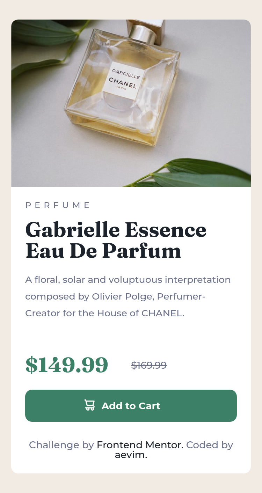

# Frontend Mentor - Product preview card component solution

This is a solution to the [Product preview card component challenge on Frontend Mentor](https://www.frontendmentor.io/challenges/product-preview-card-component-GO7UmttRfa). Frontend Mentor challenges help you improve your coding skills by building realistic projects. 

## Table of contents

- [Overview](#overview)
  - [The challenge](#the-challenge)
  - [Screenshot](#screenshot)
  - [Links](#links)
- [My process](#my-process)
  - [Built with](#built-with)
  - [What I learned](#what-i-learned)
- [Author](#author)

## Overview

### The challenge

Users should be able to:

- View the optimal layout depending on their device's screen size
- See hover and focus states for interactive elements

### Screenshot

### Links

- [Solution URL:]()
- [Live Site URL:](https://aevim.github.io/product-preview-card-component-main/)

## My process

### Built with

- Semantic HTML5 markup
- CSS Grid
- Mobile-first workflow
- [Sass](https://sass-lang.com/) - For styles
- [Haml](https://haml.info/) - For a more readable html
- BEM

### What I learned

This challenge was really fun and I think I'm getting better at writing BEM. I still need to be a bit more carefull when doing any changes and thinking a bit about how that change will afect the site in a diferente resolution, this was my major dificulty, but I think I'm getting better at it, too. I'm taking a bit slow and thinking more instead of just ignoring problem and focusing on something that I would like to do more.
I also learned how to use max-width to make my layout not get distorted.

## Author

- Frontend Mentor - [@aevim](https://www.frontendmentor.io/profile/aevim)
